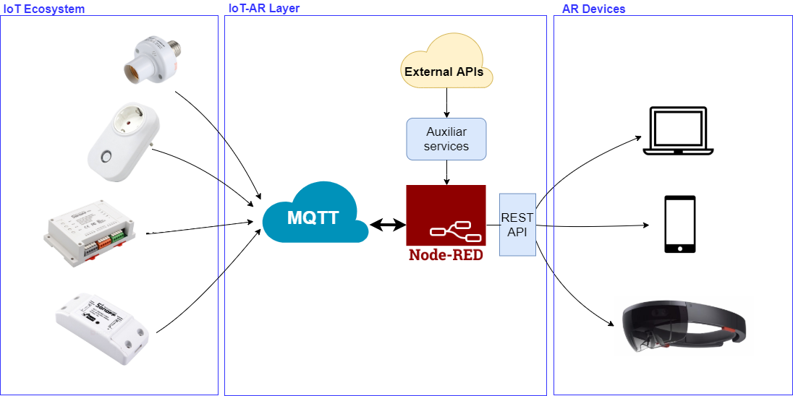

# IoT-AR-Framework

For an AR application to interact with the physical world, both the AR and the IoT device need to be able to use a shared communication mechanism and exchange messages using the same language in a way that they can understand each other. This is not straightforward, since some constraints may arise, like the heterogeneity and resource limitations of IoT hardware devices and the development restrictions oftenimposed by AR frameworks.

This framework eases the integration of AR and IoT devices as well as the transfer of information among them. It makes use of widely used protocols and open-source tools like MQTT, HTTPS or Node-RED.

